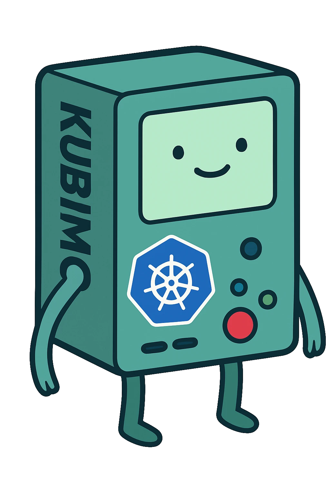

<p align="center">
  
  <h1 align="center">kubimo</h1>
</p>

## Example

Make sure to have [minikube installed and running](https://minikube.sigs.k8s.io/docs/start)

To run the controller first setup your environment. Example .envrc:

```bash
export RUST_LOG=info
export KUBIMO__RUNNER_STATUS__RESOLUTION__METHOD="Ingress"
export KUBIMO__RUNNER_STATUS__RESOLUTION__HOST="http://$(minikube ip)"
export BUILDX_BAKE_FILE="docker-bake.hcl:docker-bake.dev.hcl"
export KUBIMO__MARIMO_IMAGE="ghcr.io/aqora-io/kubimo-marimo:dev"
```

Then setup minikube

```bash
sh scripts/setup-minikube-dev.sh # setup minikube
docker buildx bake marimo # build marimo image
minikube image load ghcr.io/aqora-io/kubimo-marimo:dev # load image into minikube
```

And finally run the controller

```bash
cargo run -p kubimo --example apply_crds # apply CRDs
cargo run # run controller
```

To create an example runner run

```bash
kubectl apply -f examples/basic.yaml
```

You should be able to access it soon with `$(minikube ip)/editor`

## Upgrading from 0.2.x

The chart runs the controller Deployment with the `Recreate` strategy, so two
controllers never reconcile side by side during a rollout. Applied server-side
(Argo CD with `ServerSideApply=true`, or helm 4 with `--server-side=true`; its
default, `auto`, keeps the method the previous release was applied with), the
upgrade of a release installed with the default `RollingUpdate` is refused: the
API server filled in `spec.strategy.rollingUpdate`, no field manager owns it to
remove it, and it is forbidden beside `Recreate`. A refused upgrade leaves the
new CRDs and agent running beside the old controller, so switch the strategy
once, before upgrading. It does not restart the controller:

```bash
kubectl -n <namespace> patch deployment <deployment> --type=json \
  -p '[{"op":"replace","path":"/spec/strategy","value":{"type":"Recreate"}}]'
```

`<deployment>` is the controller Deployment the release created, which
`kubectl -n <namespace> get deployments` lists.
