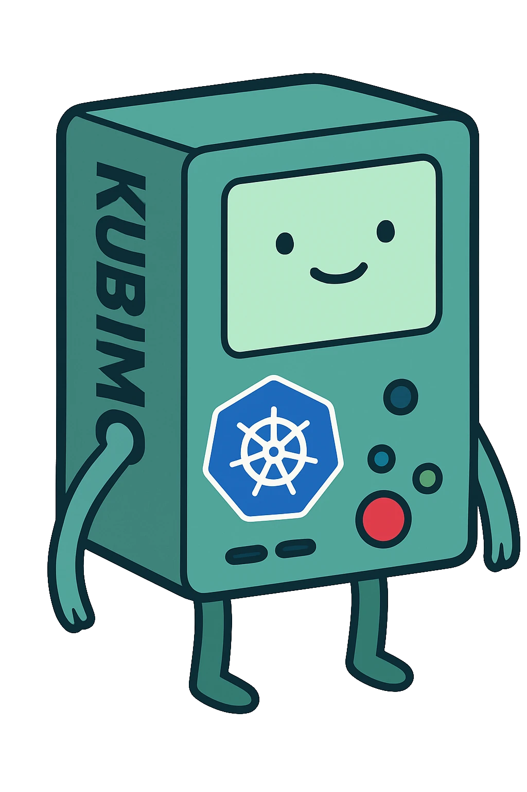

<p align="center">
  
  <h1 align="center">kubimo</h1>
</p>

## Example

Make sure to have [minikube installed and running](https://minikube.sigs.k8s.io/docs/start)

To run the controller run the following

```bash
sh scripts/setup-minikube.sh # setup minikube
export RUST_LOG=info # set log level
cargo run # run controller
```

To create an example runner run the example

```bash
cargo run --example runner
```

You should be able to access it soon with `$(minikube ip)/<runner-name>`
